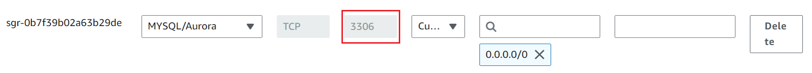
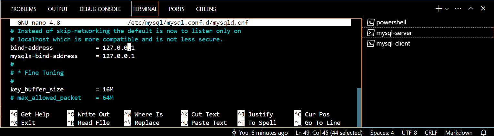
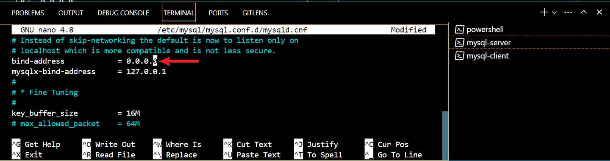

### Client-Server-Architecture Implementation:
- **This project will be deployed on AWS Cloud**

Privission two Linux-based virtual servers (EC2 instances in AWS).

```
Server A name - `mysql server``

Server B name - `mysql client`
```


On `mysql server` , install MySQL Server software.
```
sudo apt install mysql-server
```


Verify that `mysql-client and server` are installed

```
dpkg -l | grep mysql-client
dpkg -l | grep mysql-server
```
The above comands are for  command in Debian-based distributions like Ubuntu.

If you're using a different package management system or distribution, such as CentOS or Fedora, you may need to use different command

```
rpm -qa | grep mysql-server
rpm -qa | grep mysql-client
```


**`MySQL server`** uses TCP port `3306` as it's default port so you will have to open this port by allowing an Inbound rule in mysql server Security Group.



Configure MySQL server to allow connections from remote hosts

```
sudo nano /etc/mysql/mysql.conf.d/mysqld.cnf
```
Replace the bind address

```
127.0.0.1 
```

with
```
0.0.0.0
```


save and exit your command line code editor

