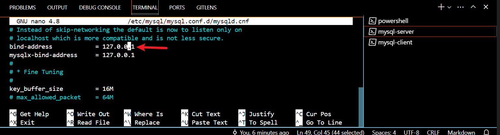

### Client-Server-Architecture Implementation:
- **This project will be deployed on AWS Cloud**

Privission two Linux-based virtual servers (EC2 instances in AWS).

```
Server A name - `mysql server``

Server B name - `mysql client`
```


On `mysql server` , install MySQL Server software.
```
sudo apt install mysql-server
```
Start mysql server
```
sudo systemctl start mysql.service
```
Ensure that the server is running using the systemctl command:
```
sudo systemctl status mysql.service
```


Verify that `mysql-client and server` are installed

```
dpkg -l | grep mysql-client
dpkg -l | grep mysql-server
```
The above comands are for  command in Debian-based distributions like Ubuntu.

If you're using a different package management system or distribution, such as CentOS or Fedora, you may need to use different command

```
rpm -qa | grep mysql-server
rpm -qa | grep mysql-client
```


 ## **Configure mysql server**

```
sudo mysql
ALTER USER 'root'@'localhost' IDENTIFIED WITH mysql_native_password BY 'PassWord.1';
```
Run a MySQL secure installation
```
sudo mysql_secure_installation
```


In the `MySQL server`, create a user and a database named first_db and a user named first_user, but you can replace these names with different values.

First, connect to the MySQL console using the root account:
```
sudo mysql -p
```

Create a new database by running this command from your MySQL console:
```
CREATE DATABASE example_database;
```

Create a new user and grant full privileges on the database we have just created.
```
CREATE USER 'example_user'@'%' IDENTIFIED WITH mysql_native_password BY 'PassWord';
```

N/B: The following command above creates a new user named `example_user`, using mysql_native_password as default authentication method. We’re defining this user’s password as password, but you should replace this value with a secure password of your own choosing.

Give this user permission over the example_database database:
```
GRANT ALL ON example_database.* TO 'example_user'@'%';
```


exit mysql console with the following command:
```
exit
or type
\q
```
bye 😄


**`MySQL server`** uses TCP port `3306` as it's default port so you will have to open this port by allowing an Inbound rule in mysql server Security Group.


Configure MySQL server to allow connections from remote hosts

```
sudo nano /etc/mysql/mysql.conf.d/mysqld.cnf
```
Replace the bind address

```
127.0.0.1 
```

with
```
0.0.0.0
```


save and exit your command line code editor.

From `mysql client` Linux Server, connect remotely to mysql server Database Engine without using SSH. You must use the `mysql utility` to perform this action.

Check that you have successfully connected to a remote MySQL server and can perform SQL queries:

GRANT ALL PRIVILEGES ON database_name.* TO 'username'@'client_ip' IDENTIFIED BY 'password';

