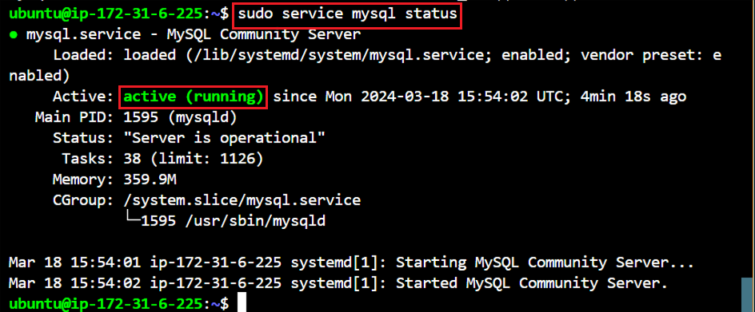

### Client-Server-Architecture Implementation:
- **This project will be deployed on AWS Cloud**

Privission two Linux-based virtual servers (EC2 instances in AWS).

```
Server A name - `mysql server``

Server B name - `mysql client`
```


On `mysql server` , install MySQL Server software.
```
sudo apt install mysql-server
```



Verify that `mysql-client` is installed
```
dpkg -l | grep mysql-client
```


Verify that `mysql-server` is installed
```
dpkg -l | grep mysql-server
```


